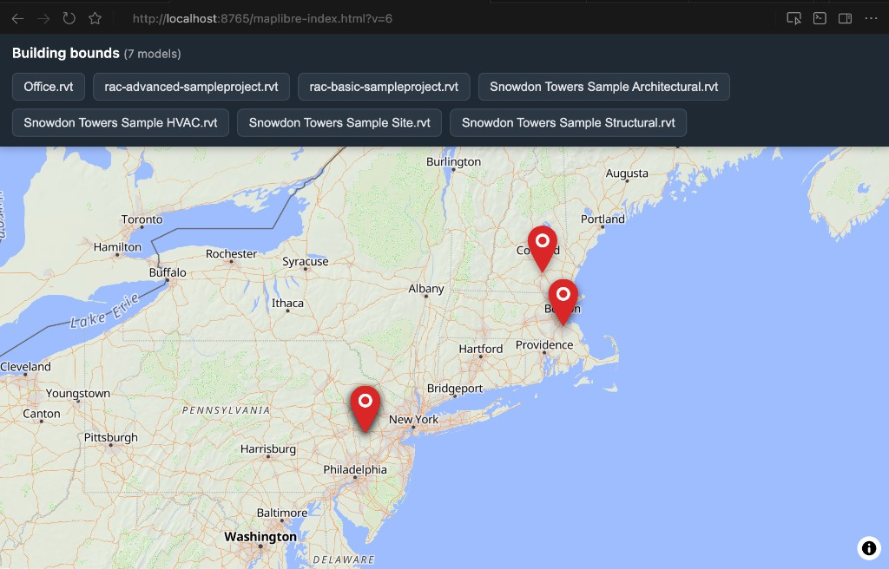
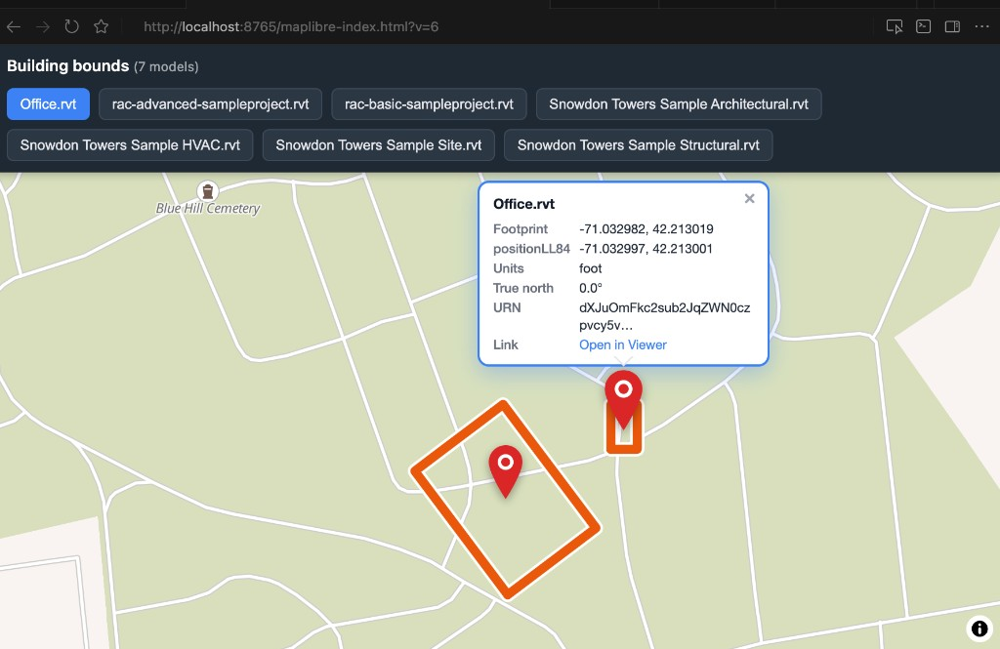

# ACC folder RVT on a map

A minimal reference for pulling **geolocation from APS Model Derivative OTG** (`otg_model.json`) and plotting **Revit building footprints** on a MapLibre map.

No ACC API wiring yet — this uses the public [aps-extensions sample bucket](https://aps-extensions.autodesk.io) as a stand-in for "a folder of RVT files." The pattern is the same: list models → fetch OTG geo → emit GeoJSON → view on a map.

## What you get

| Wide view — all models | Zoomed — footprints + metadata |
|---|---|
|  |  |

Orange lines = **AABB footprint outline** in WGS84 (rotated when the model has true-north rotation).  
Red pins = **footprint center** with an optional metadata callout (model name, coords, URN, Viewer link).

## How it works

```
RVT in bucket  →  OTG manifest  →  otg_model.json  →  footprint.py  →  GeoJSON  →  maplibre-index.html
     (URN)           (REST)         (georeference)      (math only)       (.geojson)     (pins + outlines)
```

Geolocation lives in **`otg_model.json`**, not in SVF1 or property packs:

- `georeference.positionLL84` — survey / project datum (can differ from building location on some models)
- `custom values.refPointTransform` — rotation + translation into model space
- `world bounding box` — axis-aligned bounds in model units

`footprint.py` converts the AABB corners to lon/lat using the same ellipsoid + ENU chain as the APS Viewer **Geolocation** extension.

## Quick start

```bash
python3 -m venv .venv
source .venv/bin/activate
pip install -r requirements.txt

# One model → building_bounds.geojson
python single-revit-to-geojson.py

# Whole bucket → bucket_bounds.geojson
python folder-of-revit-to-geojson.py

# View on a map (GeoJSON is embedded in the HTML)
python -m http.server 8765
open http://localhost:8765/maplibre-index.html
```

Click a **navbar button** or **pushpin** to zoom. Click the pin again, **×**, **Esc**, or empty map to hide the callout.

## Files

| File | Role |
|------|------|
| `download.py` | REST only — token, list bucket models, fetch OTG manifest + `otg_model.json` |
| `footprint.py` | Math only — model AABB → GeoJSON footprint + center point |
| `single-revit-to-geojson.py` | One RVT → one GeoJSON file |
| `folder-of-revit-to-geojson.py` | Bucket of RVTs → combined GeoJSON |
| `maplibre-index.html` | Self-contained map viewer (embedded sample GeoJSON) |
| `bucket_bounds.geojson` | Sample output — 7 APS sample models |
| `building_bounds.geojson` | Sample output — single RAC basic sample |

## Requirements

- Models must be translated to **SVF2/OTG** (not SVF1-only).
- Uses the [aps-extensions](https://github.com/wallabyway/viewer-plus-maplibre) token + bucket endpoints (no APS app credentials needed for the demo).

## Next step toward ACC

Replace `download.list_models()` with your ACC folder listing and pass each model URN through the same `footprint.build_footprint_geojson()` path. The map viewer does not care where the GeoJSON came from.

## Related

- [viewer-plus-maplibre](https://github.com/wallabyway/viewer-plus-maplibre) — APS Viewer + MapLibre sample this borrows endpoints from
- [APS Model Derivative](https://aps.autodesk.com/en/docs/model-derivative/v2/developers_guide/overview/) — translation + OTG outputs
